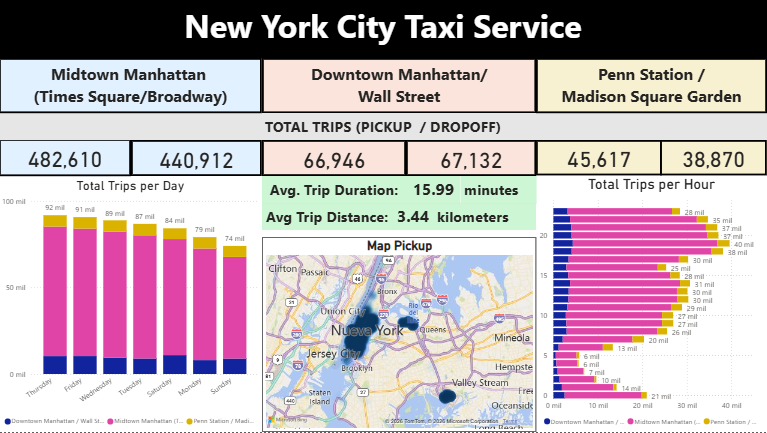
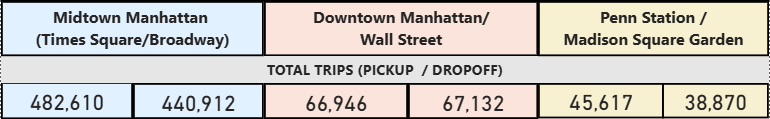
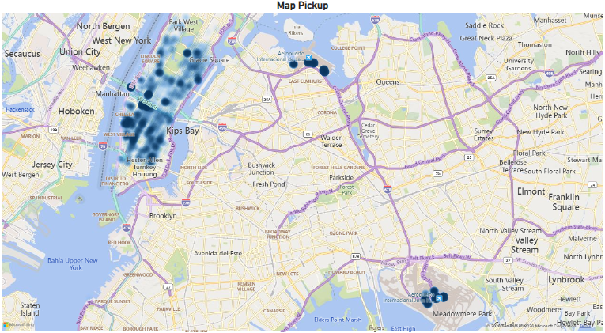
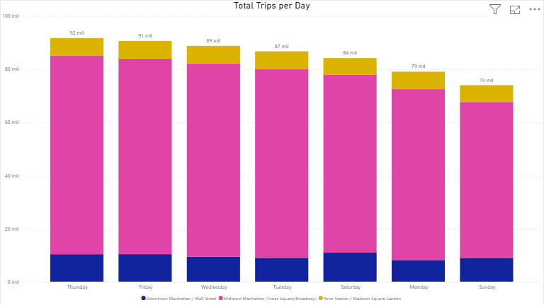
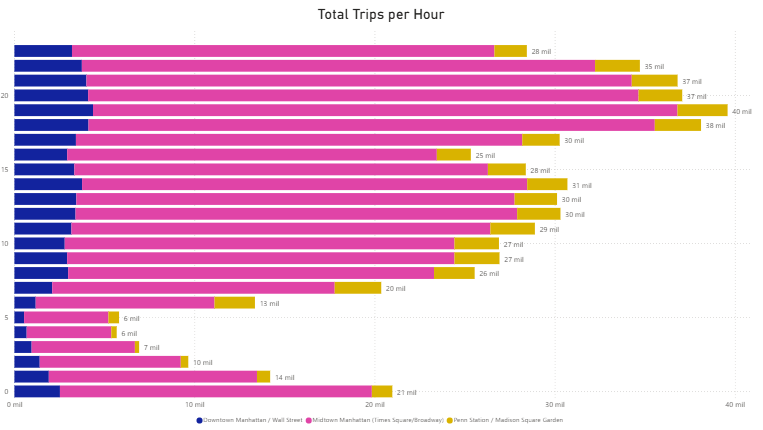

# NYC Taxi Service Dashboard
This dashboard was built using Power BI to analyze taxi trip patterns in New York City, including pickup hotspots, demand by time, and typical trip characteristics.

## Full Dashboard

## Dashboard Objective
- The goal of this dashboard is to analyze taxi trip patterns in New York City, identifying the most active pickup locations, peak demand hours, and typical trip characteristics.

## Business Questions

This dashboard aims to answer the following business questions:

- Which areas in New York City concentrate the highest taxi pickup demand?
- How dominant is Midtown Manhattan compared to other pickup locations?
- What is the average trip duration and distance for NYC taxi rides?
- Which days of the week experience the highest taxi demand?
- During which hours of the day does taxi activity peak?
- How significant are airport pickups (LaGuardia and JFK) compared to urban hotspots?

## Dataset
The dataset contains information about taxi travel time and distance in New York City. Key features include:

- *id* - Unique identifier for each trip
- *vendor_id* - Code indicating the provider associated with the trip record
- *pickup_datetime* - Date and time for passenger pickup 
- *dropoff_datetime* - Date and time for passenger dropoff
- *passenger_count* - Number of passengers
- *pickup_longitude* - Longitude coordinate for client pickup
- *pickup_latitude* - Latitude coordinate for client pickup
- *dropoff_longitude* - Longitude coordinate for client dropoff
- *dropoff_latitude* - Latitude coordinate for client dropoff
- *store_and_fwd_flag* - Y=store and forward (trip record in vehicle memory and send when connection is available); N=not a store and forward trip (real time)
- *trip_duration* - Trip duration in seconds

## Tech Stack
- **Python** – Data processing and pipeline scripting
- **Amazon S3** – Scalable cloud data storage
- **AWS Glue** – ETL data transformation
- **Haversine** - Distance calculation
- **DuckDB** – Local analytical SQL engine
- **Pandas / NumPy** – Data manipulation
- **Matplotlib / Seaborn** – Exploratory data analysis (EDA)
- **Power BI** – Data visualization and dashboarding
- **Parquet** – Columnar storage format optimized for analytics
- **PySpark** - Distributed ETL pipeline

## Project Architecture

Extract → Transform → Load

Raw CSV → Data Cleaning → Feature Engineering → Parquet Storage → SQL Analytics → Power BI Dashboard

## Metrics & Features
- *trip_distance* - Distance in kilometers between pickup and dropoff locations
- *hour* - Hour when the trip occurred
- *day_of_week* - Day when the trip occurred
- *pickup_area* - Areas defined by latitude and longitude
- *total_trips* - Total number of trips
- *trip_duration_min* - Trip duration converted from seconds to minutes
- *avg_trip_duration* - Average trip duration in minutes
- *avg_trip_distance* - Average trip distance in kilometers

## Visualizations
The dashboard includes the following visualizations:

- KPI cards summarizing pickup and dropoff trips for the three main hotspots.
- KPI cards displaying the average trip duration and distance for all taxi trips in New York City
- Heatmap showing the areas with the highest pickup activity.
- A bar chart showing the total number of trips per day (colored by pickup area).
- A bar chart showing the total number of trips per hour (colored by pickup area).

## Filters
- The dashboard includes interactive filtering. Selecting data from any bar chart updates all other visualizations.
- The pickup and dropoff KPI cards each have their own filters, and the corresponding pickup area name is displayed above each card.

## Key Insights
- Among the three main pickup hotspots, Midtown Manhattan (Times Square/Broadway) accounts for approximately 80% of the trips.
- On average, a New York City taxi trip lasts around 16 minutes and covers approximately 3.44 kilometers.
- Thursday and Friday show the highest number of taxi requests.
- The highest demand occurs during the evening period, from approximately 6:00 PM to 10:59 PM.
- LaGuardia Airport and JFK Airport are the next major pickup hotspots outside of Manhattan.

## Dashboard Highlights
Key analytical components included in the dashboard:

- KPI cards summarizing total trips, key pickup hotspots, and overall taxi activity.
- Trip-level metrics including average duration and distance per ride.
- Geospatial analysis highlighting high-demand pickup locations across NYC.
- Temporal analysis of taxi demand by day of the week and hour of the day.

## Dashboard Content

| Pickup and Dropoff | Average Duration and Distance |
|-----------|----------------------|
|  |  |

| Map Pickup |
|----------------|
|  |

| Trips by Day | Trips by Hour |
|---------------|---------------|
|  |  |
